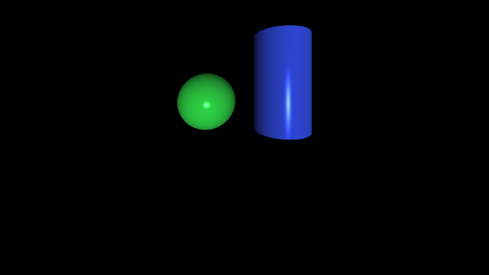

            
# miniRT

## Introduction
miniRT is an introductory project to Ray Tracing, a rendering technique used to generate realistic images by simulating light behavior. This project aims to build a basic ray tracer in C using miniLibX, allowing for the creation of simple computer-generated images. Through this project, you will learn fundamental concepts of computer graphics and gain hands-on experience implementing mathematical models for rendering.

## Features
miniRT includes the following core functionalities:
- **Scene Rendering**: Generate images based on a scene description file (`.rt`).
- **Geometric Objects**:
  - Support for planes, spheres, and cylinders.
  - Correct intersection handling and object rendering.
- **Lighting System**:
  - Ambient and diffuse lighting.
  - Hard shadows.
  - Adjustable brightness for light sources.
- **Transformations**:
  - Object translation and rotation (except for spheres and lights).
  - Adjustable object properties (e.g., sphere diameter, cylinder dimensions).
- **User Interaction**:
  - ESC key exits the program.
  - Clicking the window close button quits cleanly.
- **Scene File Format**:
  - Define objects, lights, and cameras via a structured `.rt` file.
  - Customizable positioning, orientation, and colors.

## Requirements
- The project must be written in C and adhere to coding norms.
- Memory management must be correctly handled to prevent leaks.
- Use of the **math library** (`-lm`) and **miniLibX** for graphics rendering.
- Scene descriptions must follow the specified `.rt` file format.
- The project must be submitted via a Git repository with a complete Makefile.

## Compilation
To compile miniRT, use the provided Makefile:
```sh
make
```
To clean up object files:
```sh
make clean
```
To remove all compiled files:
```sh
make fclean
```
To recompile:
```sh
make re
```

## Usage
Run the program by providing a scene description file:
```sh
./miniRT scene.rt
```
The program will generate and display the rendered image in a window.

## Learning Outcomes
By completing this project, you will gain experience in:
- Implementing mathematical models for light, objects, and transformations.
- Using **ray tracing** to simulate real-world lighting behaviors.
- Managing low-level graphics programming with **miniLibX**.
- Handling file parsing and structured data representation in C.

## License
This project is designed for educational purposes, following the guidelines of the miniRT project.

